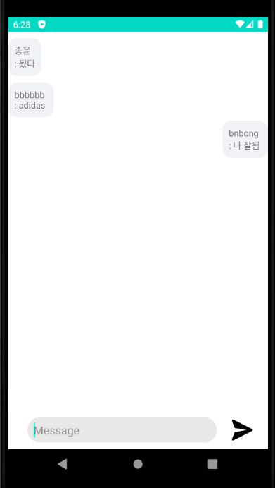

Awesome_ChattingApp
================================================================
[](https://github.com/ellerbrock/open-source-badges/)
[](https://opensource.org/licenses/MIT)


**Check detailed [Information(Korean)](index.md) or [Information(English)](index_english.md)**
*   You can read more information like contributing, wiki, downloads app etc.

**Download latest version** : [ver 0.1.0 (2020/06/24)](https://github.com/bnbong/Awesome_ChattingApp/releases/tag/0.1.0)

Development Notes : https://bnbong.github.io/awesomechatappdev/

개발관련 소통창구(Google docs) : https://docs.google.com/document/d/1BNw_6XDqAEb_z2QM1GEHxnfU61NbPqQNSCarEJzmlIg/edit

앱 소개 (Overview)
---------------------------------------------------------------

Awesome_ChattingApp은 익명성이 보장되는 누구나 빠르고 쉽게 다수의 사람들과 채팅을 할 수 있는 채팅앱입니다.
이 앱은 번거로운 로그인 절차 없이 빠르게 채팅을 하기 위해 개발되었습니다. firebase에서 제공하는 실시간으로 데이터 입출력을 가능하게 해주는 서비스를
이용하여 채팅기능을 구현했습니다.

Awesome_ChattingApp is a chat app that anyone with anonymity can chat with a large number of people quickly and easily.
This app was developed to chat quickly without the hassle of logging in. we implemented chatting services with firebase's real-time data I/O service.


### Website

https://bnbong.github.io/Awesome_ChattingApp/

  

앱 특징 (Features)
---------------------------------------------------------------
*   별도의 로그인 절차 없이 닉네임만 입력하면 바로 채팅방 입장이 가능합니다.
*   자신이 작성한 채팅과 다른 사람의 채팅을 구분해서 읽기 편합니다.
*   심플한 디자인으로 인해 한눈에 채팅 내용을 읽을 수 있습니다.


*   You can enter the chat room right away by simply typing in your nickname without having to log in.
*   It's easy to read the chat you created separately from the chat of others.
*   The simple design allows you to read the chat at a glance.

License
---------------------------------------------------------------

```
MIT LICENSE

Copyright (c) 2020 이준혁

Permission is hereby granted, free of charge, to any person obtaining a copy
of this software and associated documentation files (the "Software"), to deal
in the Software without restriction, including without limitation the rights
to use, copy, modify, merge, publish, distribute, sublicense, and/or sell
copies of the Software, and to permit persons to whom the Software is
furnished to do so, subject to the following conditions:

The above copyright notice and this permission notice shall be included in all
copies or substantial portions of the Software.

THE SOFTWARE IS PROVIDED "AS IS", WITHOUT WARRANTY OF ANY KIND, EXPRESS OR
IMPLIED, INCLUDING BUT NOT LIMITED TO THE WARRANTIES OF MERCHANTABILITY,
FITNESS FOR A PARTICULAR PURPOSE AND NONINFRINGEMENT. IN NO EVENT SHALL THE
AUTHORS OR COPYRIGHT HOLDERS BE LIABLE FOR ANY CLAIM, DAMAGES OR OTHER
LIABILITY, WHETHER IN AN ACTION OF CONTRACT, TORT OR OTHERWISE, ARISING FROM,
OUT OF OR IN CONNECTION WITH THE SOFTWARE OR THE USE OR OTHER DEALINGS IN THE
SOFTWARE.
```


개발 환경 (Development Environment)
---------------------------------------------------------------

```
Android Studio 3.6.3
Build #AI-192.7142.36.36.6392135, built on April 14, 2020
Runtime version: 1.8.0_212-release-1586-b04 amd64
VM: OpenJDK 64-Bit Server VM by JetBrains s.r.o
Windows 10 10.0
GC: ParNew, ConcurrentMarkSweep
Memory: 1237M
Cores: 12
Registry: ide.new.welcome.screen.force=true
Non-Bundled Plugins: 
SDK : Android API 29 ®
```


개발자 소개 (Developers)
---------------------------------------------------------------

Team 두둥등장

백앤드 개발 (Back-end) : [박종윤(JJongmen)](https://github.com/JJongmen/JJongmen.github.io)

db 및 이슈관리 (db & Issue tracking) : [남현기(namHG)](https://github.com/namHG/namHG.github.io)

프론트앤드 개발 (front-end) : [김택윤(GoodTY)](https://github.com/GoodTY/GoodTY.github.io)

프로젝트 관련 디렉팅 및 문서화 (directing & document) : [이준혁(bnbong)](https://github.com/bnbong/bnbong.github.io)
